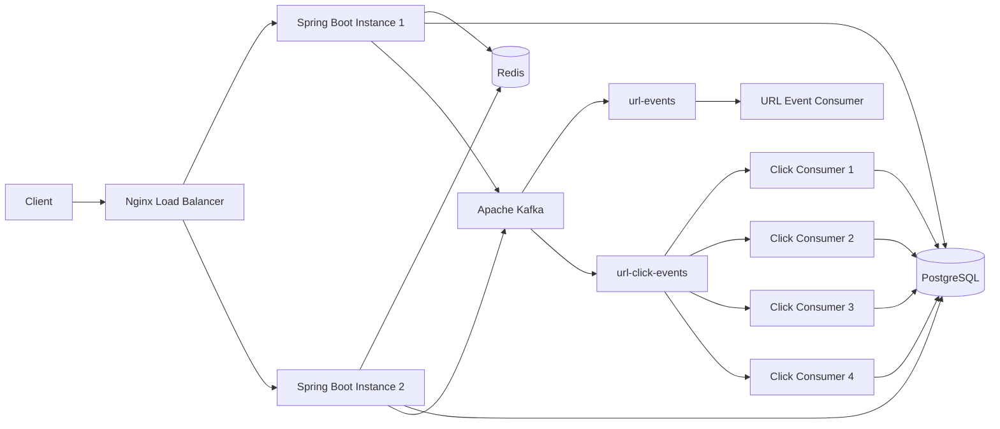

# Distributed URL Shortener

A production-oriented distributed URL shortener built with **Java, Spring Boot, PostgreSQL, Redis, Apache Kafka, Docker, and Nginx**.

The project demonstrates how a URL-shortening service can be designed to support **horizontal scaling, distributed caching, asynchronous event processing, idempotent analytics, distributed rate limiting, failure handling, load balancing, and performance testing**.

The system is designed as a local, Docker-based distributed environment that can be extended toward a production deployment.

---

## Features

* Snowflake-style distributed ID generation
* Base62 encoding for compact short URLs
* PostgreSQL as the source of truth for URL mappings
* Redis caching for low-latency URL redirects
* Asynchronous click analytics using Apache Kafka
* Separate Kafka topics for URL creation and click events
* Kafka consumer groups with 4-way parallel click-event processing
* At-least-once event processing with idempotency protection
* Unique event IDs to prevent duplicate analytics
* Retry handling and Dead Letter Topic (DLT) support
* Distributed rate limiting using Redis and Lua scripts
* Multiple Spring Boot application replicas
* Nginx load balancing
* Docker Compose based local distributed deployment
* PostgreSQL, Redis, Kafka, application replicas, and Nginx managed through Docker
* Startup readiness and dependency health checks
* Spring Boot Actuator health and metrics
* k6 load testing
* Failure testing for application replicas, Redis, and Kafka
* Cache fallback from Redis to PostgreSQL

---

# Architecture

The system consists of multiple stateless Spring Boot application instances running behind an Nginx load balancer.

Persistent state is shared through PostgreSQL, while Redis provides distributed caching and rate limiting. Kafka handles asynchronous URL and click events.



### High-Level Architecture

```text
                         ┌─────────────────────┐
                         │       Client        │
                         └──────────┬──────────┘
                                    │
                                    ▼
                         ┌─────────────────────┐
                         │   Nginx Load        │
                         │     Balancer        │
                         └──────────┬──────────┘
                                    │
                       ┌────────────┴────────────┐
                       │                         │
                       ▼                         ▼
              ┌─────────────────┐       ┌─────────────────┐
              │ Spring Boot     │       │ Spring Boot     │
              │ Instance 1      │       │ Instance 2      │
              └───────┬─────────┘       └────────┬────────┘
                      │                            │
             ┌────────┼────────┐          ┌────────┼────────┐
             │        │        │          │        │        │
             ▼        ▼        ▼          ▼        ▼        ▼
           Redis  PostgreSQL Kafka      Redis  PostgreSQL Kafka
                              │
                    ┌─────────┴─────────┐
                    │                   │
                    ▼                   ▼
              url-events       url-click-events
                                      │
                              4 Kafka partitions
                                      │
                         ┌────────────┼────────────┐
                         ▼            ▼            ▼
                    Consumers 1-4 operating
                    within the same group
                                      │
                                      ▼
                                 PostgreSQL
```

---

# API Documentation

## 1. Create Short URL

### Request

```http
POST /api/v1/urls
Content-Type: application/json
```

### Request Body

```json
{
  "originalUrl": "https://example.com"
}
```

### Response

```http
HTTP/1.1 201 Created
```

```json
{
  "shortCode": "6EKMIJ0vxS",
  "shortUrl": "http://localhost:8081/6EKMIJ0vxS"
}
```

The service generates a distributed ID, converts it to Base62, stores the URL mapping in PostgreSQL, populates Redis, and publishes a URL creation event asynchronously.

---

## 2. Redirect to Original URL

```http
GET /{shortCode}
```

Example:

```http
GET /6EKMIJ0vxS
```

The redirect endpoint first checks Redis.

```text
Request
   │
   ▼
Redis Cache
   │
   ├── Hit ──────> 302 Redirect
   │
   └── Miss
        │
        ▼
   PostgreSQL
        │
        ▼
   Populate Redis
        │
        ▼
   302 Redirect
```

---

## 3. Click Analytics

```http
GET /api/v1/urls/{shortCode}/analytics
```

Example:

```http
GET /api/v1/urls/6EKMIJ0vxS/analytics
```

Example response:

```json
{
  "shortCode": "6EKMIJ0vxS",
  "clicks": 42
}
```

Click analytics are processed asynchronously through Kafka and therefore are **eventually consistent** with redirect traffic.

---

## 4. Instance Information

```http
GET /instance
```

This endpoint can be used to identify which Spring Boot replica handled a request.

It is useful when demonstrating Nginx load balancing and horizontal scaling.

---

## 5. Health Check

```http
GET /actuator/health
```

Spring Boot Actuator exposes application health and dependency information.

---

## 6. Metrics

```http
GET /actuator/metrics
```

Available metrics can include HTTP, JVM, database connection pool, Kafka, Redis/Lettuce, executor, Tomcat, system, and process metrics depending on the enabled configuration.

---

# Core Design Decisions

## 1. Snowflake-Style Distributed ID Generation

The service uses a Snowflake-style ID generator instead of relying on a database-generated identifier for every URL.

The generated ID is converted to Base62 to produce a compact short code.

```text
Distributed ID
      │
      ▼
  Base62 Encoder
      │
      ▼
 Short Code
```

### Benefits

* Distributed ID generation
* No database round trip required to generate the identifier
* Time-ordered identifiers
* Suitable for horizontally scaled application instances
* Compact representation after Base62 encoding

The implementation also uses a worker ID mechanism so multiple application instances can generate IDs without relying on a centralized ID-generation service.

---

## 2. PostgreSQL as the Source of Truth

PostgreSQL stores the persistent URL mappings and click analytics.

The URL table contains fields including:

* ID
* Short code
* Original URL
* Creation timestamp
* Expiration timestamp

The `short_code` column is unique and indexed for efficient lookup.

Database schema changes are managed using **Flyway**.

Hibernate validates the existing schema instead of generating it automatically:

```properties
spring.jpa.hibernate.ddl-auto=validate
```

This keeps schema ownership with Flyway migrations.

---

## 3. Redis Caching

Redis is used as a distributed cache for URL redirect data.

The redirect path follows a cache-first strategy:

```text
GET /{shortCode}
       │
       ▼
     Redis
       │
   ┌───┴────┐
   │        │
  Hit     Miss
   │        │
   ▼        ▼
302      PostgreSQL
            │
            ▼
        Redis Cache
            │
            ▼
           302
```

Cached URL data uses a TTL of approximately **10 minutes**.

Redis is also used for distributed rate limiting.

If Redis becomes unavailable during a redirect lookup, the service can fall back to PostgreSQL.

---

# Kafka Event Processing

Kafka is used to decouple asynchronous processing from the synchronous URL and redirect paths.

The project uses two separate topics.

## URL Creation Events

```text
url-events
```

This topic receives `UrlCreatedEvent` messages when new short URLs are created.

```text
Application
     │
     ▼
UrlCreatedEvent
     │
     ▼
url-events
     │
     ▼
UrlCreatedEventConsumer
```

The URL creation event contains information such as:

* Short code
* Original URL
* Creation timestamp

---

## Click Events

```text
url-click-events
```

Redirect requests generate `UrlClickedEvent` messages for asynchronous analytics processing.

```text
Redirect Request
      │
      ▼
UrlClickedEvent
      │
      ▼
url-click-events
      │
      ▼
Kafka Consumer Group
      │
      ├── Consumer 1
      ├── Consumer 2
      ├── Consumer 3
      └── Consumer 4
      │
      ▼
PostgreSQL Analytics
```

The click-event topic is configured with **4 partitions**, allowing up to four consumers in the same consumer group to process partitions concurrently.

---

# Kafka Partitioning Strategy

The click-event producer uses the URL's `shortCode` as the Kafka message key.

```text
shortCode
    │
    ▼
Kafka Partitioning
    │
    ├── Partition 0
    ├── Partition 1
    ├── Partition 2
    └── Partition 3
```

Using the short code as the key ensures that events for the same URL are routed consistently to the same partition.

This provides a useful balance between:

* Parallel processing across different URLs
* Ordering of events for the same URL

The consumer group processes the four partitions concurrently.

---

# Idempotent Click Processing

Kafka consumers operate with **at-least-once delivery semantics**, which means a message can potentially be processed more than once.

To prevent duplicate analytics:

```text
Kafka Event
     │
     ▼
Check eventId
     │
     ├── Already processed ──> Ignore
     │
     └── New event
             │
             ▼
       Process analytics
             │
             ▼
       Store event identity
```

Each click event contains a unique event ID.

The database also enforces uniqueness so that the final persistence layer provides an additional guarantee against duplicate processing.

This makes the analytics processing idempotent even when Kafka redelivers an event.

---

# Retry and Dead Letter Handling

Kafka consumer failures are handled using Spring Kafka error handling.

The URL event consumer is configured with retry handling before failed records are sent to a Dead Letter Topic.

Example flow:

```text
Kafka Message
     │
     ▼
 Consumer
     │
     ├── Success ─────────────> Processed
     │
     └── Failure
          │
          ▼
       Retry
          │
          ├── Success ────────> Processed
          │
          └── Failure
                │
                ▼
             Retry
                │
                ▼
        url-events.DLT
```

The current URL event configuration retries failed processing twice with a two-second interval before routing the record to the DLT.

---

# Distributed Rate Limiting

The service implements distributed rate limiting using **Redis and Lua scripting**.

The current limit is:

```text
10 requests / minute / client IP
```

The rate limit is stored in Redis, meaning all Spring Boot replicas share the same rate-limit state.

```text
                 Nginx
                   │
          ┌────────┴────────┐
          ▼                 ▼
      Instance 1        Instance 2
          │                 │
          └────────┬────────┘
                   ▼
                 Redis
                   │
                   ▼
             Rate Limit State
```

A Lua script performs the rate-limit operation atomically.

When the limit is exceeded:

```http
HTTP/1.1 429 Too Many Requests
```

This prevents users from bypassing the limit simply by being routed to another application instance.

---

# Horizontal Scaling

The application is designed to run as multiple stateless Spring Boot instances.

```text
                    Nginx
                      │
             ┌────────┴────────┐
             ▼                 ▼
        App Instance 1    App Instance 2
             │                 │
             └────────┬────────┘
                      │
          ┌───────────┼───────────┐
          ▼           ▼           ▼
       Redis      PostgreSQL     Kafka
```

Application-local state is minimized so that requests can be handled by any available replica.

Shared state is maintained by infrastructure components such as PostgreSQL, Redis, and Kafka.

---

# API Flow / Request Lifecycle

## Create Short URL

```text
POST /api/v1/urls
        │
        ▼
UrlController
        │
        ▼
UrlService
        │
        ├── Generate distributed ID
        │
        ├── Base62 encode
        │
        ├── Persist URL mapping
        │
        ├── Populate Redis
        │
        └── Publish UrlCreatedEvent
                    │
                    ▼
               url-events
                    │
                    ▼
          UrlCreatedEventConsumer
```

The URL creation request does not depend on the analytics pipeline completing successfully.

---

## Redirect

```text
GET /{shortCode}
        │
        ▼
RedirectController
        │
        ▼
Redis Cache
        │
        ├── Hit ──────> 302 Redirect
        │
        └── Miss
             │
             ▼
        PostgreSQL
             │
             ▼
        Redis Cache
             │
             ▼
        302 Redirect
```

A click event can then be published asynchronously for analytics processing.

---

## Click Analytics

```text
Redirect
   │
   ▼
UrlClickedEvent
   │
   ▼
url-click-events
   │
   ▼
4 Kafka Partitions
   │
   ▼
Consumer Group
   │
   ▼
Idempotency Check
   │
   ▼
PostgreSQL
   │
   ▼
Updated Click Analytics
```

Analytics processing is intentionally separated from the synchronous redirect path.

---

# Reliability & Failure Testing

The system includes failure scenarios designed to demonstrate how the distributed components behave when individual dependencies become unavailable.

## Application Replica Failure

Two Spring Boot replicas run behind Nginx.

A replica can be stopped while the other continues serving traffic.

Expected behavior:

```text
Nginx
  │
  ├── App 1 ── X
  │
  └── App 2 ──> Handles requests
```

The remaining replica continues serving redirect traffic.

---

## Redis Failure

When Redis is unavailable during URL lookup, the application can fall back to PostgreSQL.

```text
Request
   │
   ▼
Redis ── X
   │
   ▼
PostgreSQL
   │
   ▼
302 Redirect
```

This prevents a cache failure from becoming a complete redirect outage.

---

## Kafka Failure

Kafka is used for asynchronous processing rather than being required for the core redirect lookup.

If Kafka becomes unavailable:

```text
Redirect Request
      │
      ▼
Redis / PostgreSQL
      │
      ▼
302 Redirect
```

The redirect path can continue to return the URL.

However, click-event publishing cannot complete while Kafka is unavailable, so analytics events may be lost when publishing is configured as best effort.

This is an intentional trade-off between redirect availability and asynchronous analytics durability.

---

## Startup Readiness

Docker Compose health checks are used for infrastructure dependencies.

The application depends on services such as:

* PostgreSQL
* Redis
* Kafka

Nginx starts after the application services are available.

This reduces startup race conditions when bringing the entire environment up with Docker Compose.

---

## Rate-Limit Failure Scenario

The rate limiter is shared through Redis across application replicas.

Example:

```text
Client
  │
  ├── Request 1 ──> App 1
  ├── Request 2 ──> App 2
  ├── Request 3 ──> App 1
  └── ...
             │
             ▼
           Redis
             │
       Shared Counter
```

Once the configured threshold is exceeded, the API returns:

```http
429 Too Many Requests
```

---

# Reliability Test Summary

| Scenario                    | Expected Behavior                                                    |
| --------------------------- | -------------------------------------------------------------------- |
| Application replica failure | Remaining replica continues serving traffic                          |
| Redis failure               | Redirect falls back to PostgreSQL                                    |
| Kafka failure               | Redirect path remains available; asynchronous publishing is affected |
| Duplicate Kafka event       | Idempotency prevents duplicate analytics                             |
| Consumer processing failure | Retry followed by DLT                                                |
| Rate-limit overflow         | HTTP 429                                                             |
| Delayed dependency startup  | Health/readiness checks prevent premature startup                    |

These tests are intended to demonstrate system behavior under controlled local failure scenarios rather than represent production SLA guarantees.

---

# Performance Testing

The redirect path was benchmarked locally using **k6**.

## Test Environment

* Docker Compose environment
* Two Spring Boot application replicas
* Nginx load balancing
* PostgreSQL running in Docker
* Redis running in Docker
* Kafka running in Docker
* Existing short URL
* Redis caching enabled
* 100 virtual users
* 30-second test duration
* Redirect following disabled

The benchmark focused on the redirect endpoint rather than end-to-end URL creation and analytics processing.

---

## Results

| Run   | Requests/sec | Avg Latency | P95 Latency | Errors |
| ----- | -----------: | ----------: | ----------: | -----: |
| Run 1 |         1166 |    85.40 ms |   167.22 ms |     0% |
| Run 2 |         1081 |    91.82 ms |   131.99 ms |     0% |
| Run 3 |         1282 |    77.72 ms |   122.39 ms |     0% |

### Average

Approximately:

* **1176 requests/sec**
* **85 ms average latency**
* **141 ms P95 latency**
* **0% request errors**
* **100% successful HTTP 302 responses**

These results were obtained in a local Docker environment and should **not** be interpreted as production capacity.

Actual throughput in production would depend on hardware, network characteristics, database configuration, Kafka configuration, deployment topology, traffic patterns, and other infrastructure factors.

---

# Observability

Spring Boot Actuator is used for application health and metrics.

## Health

```http
GET /actuator/health
```

Health information can be used to determine whether the application and configured dependencies are available.

---

## Metrics

```http
GET /actuator/metrics
```

The application exposes metrics across areas such as:

* HTTP requests
* JVM
* CPU
* Memory
* HikariCP
* JDBC
* Kafka
* Redis / Lettuce
* Executor pools
* Tomcat
* Process
* System

These metrics provide visibility into application behavior during development, failure testing, and load testing.

---

# Project Structure

```text
distributed-url-shortener/
│
├── src/
│   ├── main/
│   │   ├── java/
│   │   │   └── com/
│   │   │       └── yatharth/
│   │   │           └── distributedurlshortener/
│   │   │
│   │   │               ├── config/
│   │   │               │   ├── KafkaConfig
│   │   │               │   ├── KafkaConsumerConfig
│   │   │               │   ├── KafkaErrorHandlingConfig
│   │   │               │   ├── RateLimitInterceptor
│   │   │               │   ├── RedisConfig
│   │   │               │   └── WebConfig
│   │   │               │
│   │   │               ├── consumer/
│   │   │               │   ├── UrlClickedEventConsumer
│   │   │               │   └── UrlCreatedEventConsumer
│   │   │               │
│   │   │               ├── controller/
│   │   │               │   ├── AnalyticsController
│   │   │               │   ├── HomeController
│   │   │               │   ├── InstanceController
│   │   │               │   ├── RedirectController
│   │   │               │   └── UrlController
│   │   │               │
│   │   │               ├── dto/
│   │   │               │   ├── CreateShortUrlRequest
│   │   │               │   ├── CreateShortUrlResponse
│   │   │               │   ├── UrlAnalyticsResponse
│   │   │               │   └── UrlRedirectData
│   │   │               │
│   │   │               ├── entity/
│   │   │               │   ├── Url
│   │   │               │   ├── UrlAnalytics
│   │   │               │   └── UrlClickAnalytics
│   │   │               │
│   │   │               ├── event/
│   │   │               │   ├── UrlClickedEvent
│   │   │               │   └── UrlCreatedEvent
│   │   │               │
│   │   │               ├── exception/
│   │   │               │   ├── ErrorResponse
│   │   │               │   ├── GlobalExceptionHandler
│   │   │               │   └── UrlNotFoundException
│   │   │               │
│   │   │               ├── producer/
│   │   │               │   ├── UrlClickEventProducer
│   │   │               │   └── UrlEventProducer
│   │   │               │
│   │   │               ├── repository/
│   │   │               │   ├── UrlAnalyticsRepository
│   │   │               │   ├── UrlClickAnalyticsRepository
│   │   │               │   └── UrlRepository
│   │   │               │
│   │   │               ├── service/
│   │   │               │   ├── AnalyticsService
│   │   │               │   ├── RateLimitService
│   │   │               │   └── UrlService
│   │   │               │
│   │   │               └── util/
│   │   │                   ├── Base62Encoder
│   │   │                   ├── SnowflakeIdGenerator
│   │   │                   └── WorkerIdManager
│   │   │
│   │   └── resources/
│   │       ├── db/
│   │       │   └── migration/
│   │       ├── static/
│   │       └── templates/
│   │
│   └── test/
│
├── nginx/
│   └── nginx.conf
│
├── Dockerfile
├── docker-compose.yml
├── load-test.js
├── pom.xml
└── README.md
```

---

# Package Responsibilities

| Package      | Responsibility                                     |
| ------------ | -------------------------------------------------- |
| `config`     | Kafka, Redis, rate limiting, and web configuration |
| `controller` | REST API and redirect endpoints                    |
| `dto`        | API request and response models                    |
| `entity`     | JPA persistence models                             |
| `event`      | Kafka event definitions                            |
| `producer`   | Kafka event publishing                             |
| `consumer`   | Kafka event consumption                            |
| `repository` | Database access                                    |
| `service`    | Application and business logic                     |
| `exception`  | Exception handling and API error responses         |
| `util`       | ID generation, worker IDs, and Base62 encoding     |

---

# Running Locally

The complete infrastructure is containerized.

You **do not need to install PostgreSQL, Redis, Kafka, or Nginx locally**.

## Prerequisites

Install only:

* Java 17 or newer
* Docker
* Docker Compose
* Git

The project uses the Maven Wrapper, so a separate Maven installation is not required.

---

## 1. Clone the Repository

```bash
git clone <repository-url>
cd distributed-url-shortener
```

---

## 2. Start the Infrastructure

Start the Docker Compose environment:

```bash
docker compose up -d
```

The Compose environment provides the required infrastructure and application services.

Typical service ports include:

| Service     |                       Port |
| ----------- | -------------------------: |
| PostgreSQL  |                     `5432` |
| Redis       |                     `6379` |
| Kafka       |                     `9092` |
| Application |                     `8081` |
| Nginx       | configured through Compose |

The exact application/Nginx ports are defined by `docker-compose.yml`.

---

## 3. Start the Application

### Windows

```powershell
.\mvnw.cmd spring-boot:run
```

### Linux / macOS

```bash
./mvnw spring-boot:run
```

Flyway migrations run automatically when the application starts.

---

# Kafka Topics

The project uses two Kafka topics.

## URL Events

```text
url-events
```

Used for URL creation events.

Example event:

```text
UrlCreatedEvent
```

---

## Click Events

```text
url-click-events
```

Used for asynchronous click analytics.

The click-event topic uses **4 partitions** to support parallel consumer processing.

```text
url-click-events
├── Partition 0
├── Partition 1
├── Partition 2
└── Partition 3
```

The consumer group processes these partitions concurrently.

---

## Verify Kafka Topics

If topic inspection is required, use the Kafka container defined by Docker Compose.

For example:

```bash
docker compose exec kafka kafka-topics \
  --bootstrap-server localhost:9092 \
  --list
```

The exact Kafka container/service name depends on the `docker-compose.yml` configuration.

Expected topics include:

```text
url-events
url-click-events
```

---

# Example API Usage

## Create a Short URL

```bash
curl -X POST http://localhost:8081/api/v1/urls \
  -H "Content-Type: application/json" \
  -d "{\"originalUrl\":\"https://example.com\"}"
```

Example response:

```json
{
  "shortCode": "6EKMIJ0vxS",
  "shortUrl": "http://localhost:8081/6EKMIJ0vxS"
}
```

---

## Redirect

Open:

```text
http://localhost:8081/6EKMIJ0vxS
```

The service returns:

```http
302 Found
Location: https://example.com
```

---

## Get Analytics

```bash
curl http://localhost:8081/api/v1/urls/6EKMIJ0vxS/analytics
```

Example:

```json
{
  "shortCode": "6EKMIJ0vxS",
  "clicks": 42
}
```

---

# Configuration

Configuration is externalized through Spring configuration and environment variables.

## PostgreSQL

Example configuration:

```properties
spring.datasource.url=jdbc:postgresql://localhost:5432/urlshortener
spring.datasource.username=postgres
spring.datasource.password=${DATABASE_PASSWORD}
spring.jpa.hibernate.ddl-auto=validate
```

Database schema changes are managed through:

```text
src/main/resources/db/migration/
```

---

## Redis

```properties
spring.data.redis.host=localhost
spring.data.redis.port=6379
```

---

## Kafka

```properties
spring.kafka.bootstrap-servers=localhost:9092
```

The application uses the configured Kafka topics and consumer groups for asynchronous event processing.

---

# Environment Variables

The application supports environment-based configuration such as:

```text
DATABASE_URL
DATABASE_USERNAME
DATABASE_PASSWORD
REDIS_HOST
REDIS_PORT
KAFKA_BOOTSTRAP_SERVERS
```

This allows the same application configuration to be adapted between local Docker development and a future production deployment.

---

# Local Deployment Architecture

```text
┌─────────────────────────────────────────────────────┐
│                  Docker Compose                     │
│                                                     │
│  ┌──────────┐                                       │
│  │  Nginx   │                                       │
│  └────┬─────┘                                       │
│       │                                             │
│   ┌───┴───────────────┐                             │
│   │                   │                             │
│   ▼                   ▼                             │
│ App Instance 1   App Instance 2                     │
│   │                   │                             │
│   └───────┬───────────┘                             │
│           │                                         │
│     ┌─────┼──────────────┐                          │
│     ▼     ▼              ▼                          │
│  Redis PostgreSQL      Kafka                        │
│                           │                         │
│                  ┌────────┴────────┐                │
│                  ▼                 ▼                │
│             url-events     url-click-events         │
│                                      │              │
│                              4 partitions           │
│                                      │              │
│                              Click Consumers        │
│                                      │              │
│                                      ▼              │
│                                 PostgreSQL          │
└─────────────────────────────────────────────────────┘
```

---

# Testing Strategy

The project is designed to test both individual components and distributed-system behavior.

## Unit Tests

Potential unit-test areas include:

* URL validation
* Short-code generation
* Base62 encoding
* Snowflake-style ID generation
* Worker ID handling
* URL service logic
* Rate limiting
* Analytics processing
* Exception handling

---

## Integration Tests

Integration testing can cover:

* PostgreSQL persistence
* Flyway migrations
* Redis caching
* Kafka publishing
* Kafka consumption
* Duplicate event processing
* Analytics persistence
* Health checks
* Dependency availability

---

## Distributed-System Scenarios

The project also considers:

* Multiple Spring Boot replicas
* Nginx load balancing
* Application replica failure
* Redis failure
* Kafka failure
* Duplicate Kafka events
* Consumer processing failure
* Retry and DLT handling
* Concurrent rate-limit requests
* Delayed dependency startup

---

# Load Testing

k6 is used for HTTP performance testing.

The load-testing script can be found at:

```text
load-test.js
```

The current benchmark uses:

```text
100 virtual users
30 seconds
```

The test targets an existing short URL and disables redirect following so that the performance of the redirect endpoint itself can be measured.

Example:

```text
Client
  │
  ▼
Nginx
  │
  ├── App 1
  └── App 2
       │
       ▼
     Redis
       │
       ▼
   302 Response
```

---

# Failure Testing Philosophy

The goal of failure testing is not simply to verify that individual services work.

It is to understand what happens when one component becomes unavailable.

Examples:

```text
Redis fails
    │
    ▼
Can PostgreSQL keep redirects working?
```

```text
Kafka fails
    │
    ▼
Can the synchronous redirect path remain available?
```

```text
Application instance fails
    │
    ▼
Can Nginx route traffic to another instance?
```

```text
Kafka event is duplicated
    │
    ▼
Can analytics remain correct?
```

This helps demonstrate the difference between **component availability**, **data durability**, and **eventual consistency**.

---

# Future Improvements

The current implementation provides a local distributed-system environment. Possible future extensions include:

## Infrastructure

* AWS ECS deployment
* Kubernetes deployment
* Infrastructure as Code
* Managed PostgreSQL
* Managed Redis
* Multi-broker Kafka cluster
* Centralized configuration
* CI/CD pipeline

## Scalability

* PostgreSQL read replicas
* Redis Cluster
* Kafka partition scaling
* CDN integration
* Traffic-aware load balancing

## Analytics

* More detailed click metadata
* Geographic analytics
* Device/browser analytics
* Time-series analytics
* Dedicated analytical storage
* Analytics dashboards

## Reliability

* Circuit breakers
* More comprehensive DLT recovery
* Distributed tracing
* Centralized logging
* Alerting
* Automated recovery testing
* Kafka recovery testing

## Security

* Authentication and authorization
* API keys or access tokens
* HTTPS
* Abuse detection
* Stronger URL validation
* Request validation and security controls

## Testing

* Broader automated test coverage
* Testcontainers
* CI-based load testing
* Automated failure injection
* Kafka recovery tests
* Concurrency testing

---

# Technologies Used

## Backend

* Java
* Spring Boot
* Spring MVC
* Spring Data JPA
* Hibernate
* Spring Kafka

## Data & Messaging

* PostgreSQL
* Redis
* Apache Kafka
* Flyway

## Distributed Systems

* Snowflake-style ID generation
* Base62 encoding
* Distributed caching
* Redis Lua scripting
* Distributed rate limiting
* Kafka partitions
* Kafka consumer groups
* Idempotent event processing
* Retry and Dead Letter Topics
* Horizontal application scaling
* Nginx load balancing

## Infrastructure

* Docker
* Docker Compose
* Nginx

## Observability & Testing

* Spring Boot Actuator
* k6
* Health checks
* JVM and infrastructure metrics
* Failure testing

---

# Design Principles

The project focuses on several distributed-system principles:

### Stateless Application Instances

Application replicas do not rely on local state for URL persistence or rate limiting.

### Shared Infrastructure

PostgreSQL, Redis, and Kafka provide shared state and coordination across application instances.

### Cache-Aside Reads

Redis is used as a cache while PostgreSQL remains the source of truth.

### Asynchronous Processing

Click analytics are decoupled from the redirect path through Kafka.

### At-Least-Once Processing

Kafka consumers are designed around at-least-once delivery with idempotent processing.

### Failure Isolation

Non-critical asynchronous processing is separated from the synchronous redirect path.

### Horizontal Scaling

Multiple application replicas can operate behind Nginx.

### Measured Performance

Performance claims are based on local k6 measurements rather than theoretical throughput estimates.

---

# Project Status

The project currently provides a locally runnable distributed URL-shortening environment with:

* URL creation
* Short-code generation
* PostgreSQL persistence
* Redis caching
* Kafka-based asynchronous processing
* Click analytics
* Idempotent event processing
* Retry and DLT handling
* Distributed rate limiting
* Multiple application replicas
* Nginx load balancing
* Docker Compose deployment
* Health checks
* Actuator metrics
* k6 performance testing
* Controlled failure testing

The architecture is intentionally designed so that the local implementation can be extended toward cloud deployment and larger-scale distributed infrastructure.

---

# License

This project is intended for educational, portfolio, and system-design demonstration purposes.

If a specific open-source license is added to the repository, this section should be updated to reference that license directly.
