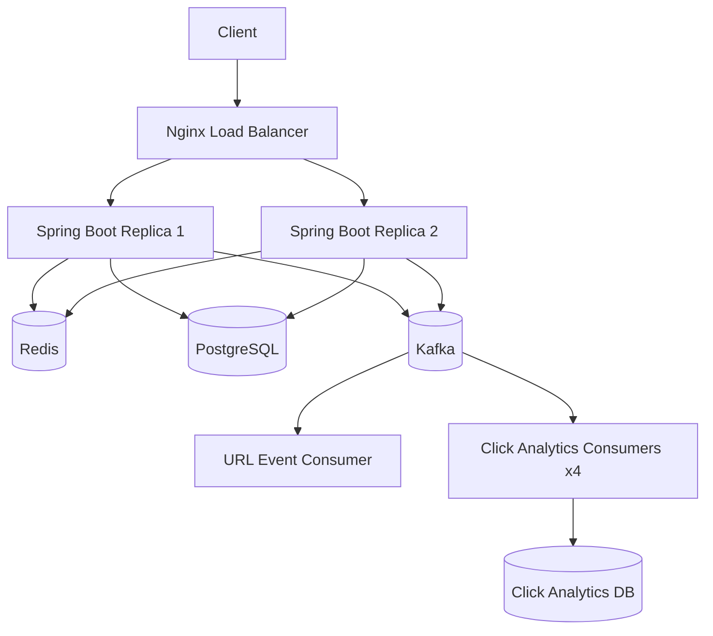

# Distributed URL Shortener

A production-oriented distributed URL shortener built with **Java, Spring Boot, PostgreSQL, Redis, Kafka, Docker, and Nginx**.

The project focuses on distributed-system fundamentals such as horizontal scaling, distributed caching, asynchronous event processing, idempotency, rate limiting, failure handling, and load balancing.

---

## Features

- Short URL generation using a **Snowflake-style distributed ID generator + Base62 encoding**
- PostgreSQL as the source of truth
- Redis caching for high-frequency redirect lookups
- Asynchronous click analytics using Apache Kafka
- Kafka consumer groups with **4-way parallel click processing**
- Idempotent click-event processing using unique event IDs
- Kafka retry handling and Dead Letter Topic (DLT)
- Distributed rate limiting using Redis + atomic Lua scripting
- Horizontal scaling with multiple Spring Boot replicas
- Nginx load balancing
- Docker Compose-based local deployment
- Application readiness and dependency health checks
- Spring Boot Actuator metrics and health endpoints
- k6 load testing
- Failure testing for application replicas and Kafka

---

## Architecture



## API Documentation

### Create Short URL

Creates a shortened URL for the supplied original URL.

**Endpoint**

```http
POST /api/v1/urls
```

**Request**

```json
{
  "originalUrl": "https://example.com"
}
```

**Response — `201 Created`**

```json
{
  "shortCode": "6J5skeLVzW",
  "shortUrl": "http://localhost:8080/6J5skeLVzW"
}
```

The short code is generated using a Snowflake-style distributed ID generator and Base62 encoding.

---

### Redirect

Redirects the client to the original URL associated with a short code.

**Endpoint**

```http
GET /{shortCode}
```

**Example**

```http
GET /6J5skeLVzW
```

**Response — `302 Found`**

```http
HTTP/1.1 302 Found
Location: https://example.com
```

The redirect path first checks Redis for the short code. On a cache miss, the application queries PostgreSQL and caches the result in Redis.

---

### Click Analytics

Returns the number of recorded clicks for a short URL.

**Endpoint**

```http
GET /{shortCode}/analytics
```

**Example**

```http
GET /6J5skeLVzW/analytics
```

**Response**

```json
{
  "shortCode": "6J5skeLVzW",
  "clicks": 125
}
```

Click events are published asynchronously to Kafka and persisted by the click analytics consumer.

Analytics are therefore eventually consistent with redirect traffic.

---

### Instance Information

Returns the identifier of the Spring Boot application instance handling the request.

**Endpoint**

```http
GET /instance
```

**Example Response**

```text
<instance-id>
```

This endpoint is used to verify Nginx load balancing across multiple Spring Boot replicas.

---

### Health

Returns the health status of the application and its configured dependencies.

**Endpoint**

```http
GET /actuator/health
```

Spring Boot Actuator is used to expose health information and application metrics.

---

### Metrics

Exposes application and infrastructure metrics through Spring Boot Actuator.

**Endpoint**

```http
GET /actuator/metrics
```

Available metrics include HTTP requests, JVM statistics, database connection pool metrics, Kafka producer/consumer metrics, Redis/Lettuce metrics, and system/process metrics.


## Core Design Decisions

### Distributed ID Generation

The system uses a Snowflake-style ID generator to create unique, time-ordered IDs without relying on a centralized database sequence.

The generated numeric ID is encoded using Base62 to produce a compact, URL-safe short code.

This approach provides:

* Unique IDs across application instances
* Time-ordered identifiers
* No database round-trip for ID generation
* Compact Base62 short codes
* Compatibility with horizontal scaling

---

### PostgreSQL

PostgreSQL is used as the primary persistent data store for URL mappings and click analytics.

Flyway manages database schema changes through versioned migrations, while Hibernate/JPA is configured with schema validation rather than automatic schema creation.

The `short_code` column has a unique constraint and index to support efficient redirect lookups.

---

### Redis Caching

Redis is used to cache URL redirect data and reduce repeated PostgreSQL queries on frequently accessed short URLs.

The redirect flow is:

```text
Request
   │
   ▼
Redis Cache
   │
   ├── Hit ──► Return URL
   │
   └── Miss
         │
         ▼
    PostgreSQL
         │
         ▼
    Store in Redis
         │
         ▼
      Return URL
```

Cached entries use a 10-minute TTL.

This reduces database load for repeated redirects while keeping PostgreSQL as the source of truth.

---

### Kafka Analytics

Kafka is used to decouple the redirect path from click analytics processing.

A successful redirect does not wait for analytics persistence to complete. Instead, the application publishes a `UrlClickedEvent` asynchronously to the `url-click-events` topic.

The analytics consumer processes these events and persists them to PostgreSQL.

```text
Client
  │
  ▼
Redirect API
  │
  ├──────────────► 302 Redirect
  │
  └──► Kafka
         │
         ▼
   Click Consumer
         │
         ▼
   PostgreSQL
```

This makes analytics eventually consistent while keeping the latency-sensitive redirect path independent of analytics processing.

Kafka publishing for click analytics is intentionally best-effort. If Kafka is unavailable, the redirect can still succeed, but the corresponding analytics event may be lost.

---

### Kafka Partitioning

The `url-click-events` topic uses four partitions.

Events are published using the URL's `shortCode` as the Kafka message key. Kafka therefore routes events for the same short code to the same partition while allowing events for different short codes to be processed concurrently.

The click analytics consumer uses four concurrent consumer threads, allowing the four partitions to be processed in parallel.

This provides a balance between per-key ordering and parallel event processing.

---

### Idempotency

Kafka provides at-least-once delivery semantics, which means an event may be delivered more than once.

Click events therefore contain a unique `eventId`.

The analytics table enforces a unique constraint on this identifier. The consumer also performs an existence check before persisting an event.

```text
Kafka Event
     │
     ▼
Check eventId
     │
 ┌───┴────┐
 │        │
Exists   New
 │        │
 ▼        ▼
Ignore   Persist
```

The database uniqueness constraint provides the final correctness guarantee against duplicate records.

---

### Retry + Dead Letter Topic

Kafka consumers use Spring Kafka's `DefaultErrorHandler` with a fixed retry policy.

For the URL event consumer, a failed message is retried twice with a 2-second interval.

If processing continues to fail, the message is published to:

```text
url-events.DLT
```

This prevents a permanently failing message from repeatedly blocking normal event processing and provides a separate destination for failed events.

---

### Distributed Rate Limiting

The application implements a distributed fixed-window rate limiter using Redis and an atomic Lua script.

The default limit is:

```text
10 requests / minute / client IP
```

Redis provides shared state across application replicas, meaning the limit is enforced consistently even when requests are distributed across multiple Spring Boot instances.

The Lua script performs the counter check and update atomically, preventing race conditions between concurrent requests.

---

### Horizontal Scaling

The application is designed to run as multiple stateless Spring Boot instances behind Nginx.

Shared state is maintained outside individual application instances:

* PostgreSQL stores persistent data
* Redis stores shared cache and rate-limit state
* Kafka provides asynchronous event processing

Nginx distributes incoming requests across the application replicas.

This allows application instances to be added or removed without requiring application-local state migration.


## Reliability & Failure Testing

The system was tested under dependency and application-instance failures to verify that the distributed architecture continues serving traffic where the affected component is not required for the request path.

### Application Replica Failure

Two Spring Boot application replicas were deployed behind Nginx.

One replica was intentionally stopped while the system was receiving traffic.

**Result:**

* Nginx continued routing requests to the remaining application instance.
* Redirect requests continued to return `302 Found`.
* No HTTP errors were observed during the failure test.

This validates horizontal scaling and application-instance failure tolerance.

---

### Kafka Failure

Kafka was intentionally stopped while the application remained available.

The redirect path was designed so that click analytics publishing is asynchronous and best-effort.

**Result:**

* Redirect requests continued to return `302 Found`.
* The application did not fail the redirect request because Kafka was unavailable.
* Click analytics events could not be published while Kafka was down.

This demonstrates that the latency-sensitive redirect path is decoupled from the analytics pipeline.

---

### Redis Failure

Redis failure was tested to verify that the application can continue operating without the cache layer.

The system falls back to PostgreSQL for URL retrieval when cached data is unavailable.

This preserves PostgreSQL as the source of truth while Redis acts as a performance optimization rather than a required persistence layer.

---

### Startup Dependency Readiness

Docker Compose health checks were added for:

* PostgreSQL
* Redis
* Kafka

The application waits for these dependencies to become healthy before startup, reducing failures caused by attempting to connect to dependencies that are still initializing.

Nginx is started after the application service is available.

---

### Rate Limiting Under Load

The distributed rate limiter was tested through the Nginx load balancer.

With the default configuration of **10 requests per minute per client IP**, requests beyond the configured limit returned:

```text
HTTP 429 Too Many Requests
```

Because rate-limit state is stored in Redis, the limit is shared across application replicas rather than maintained independently by each instance.

---

### Failure Testing Summary

| Scenario                    | Expected Behavior                                 | Result |
| --------------------------- | ------------------------------------------------- | ------ |
| Application replica failure | Traffic continues through remaining replica       | Passed |
| Kafka unavailable           | Redirect remains available; analytics may be lost | Passed |
| Redis unavailable           | URL retrieval can fall back to PostgreSQL         | Passed |
| Dependency startup delay    | Application waits for healthy dependencies        | Passed |
| Rate limit exceeded         | Requests return `429`                             | Passed |


## Observability

The application uses Spring Boot Actuator to expose health information and runtime metrics for monitoring application and infrastructure behavior.

### Health Monitoring

The following endpoint exposes application health information:

```http
GET /actuator/health
```

Health checks cover the application's configured dependencies, including:

* PostgreSQL
* Redis
* Kafka

This allows the application and deployment environment to detect dependency availability.

---

### Application Metrics

The following endpoint exposes individual application metrics:

```http
GET /actuator/metrics
```

Metrics include:

* HTTP server request counts and latency
* JVM memory and runtime statistics
* HikariCP database connection pool metrics
* JDBC connection metrics
* Kafka producer and consumer metrics
* Redis/Lettuce metrics
* Executor metrics
* System and process metrics
* Tomcat session metrics

These metrics provide visibility into request performance, resource utilization, database connections, messaging activity, and runtime behavior.

---

### Performance Monitoring

HTTP request metrics can be used to inspect request counts and latency distributions, while infrastructure metrics help identify potential bottlenecks such as:

* Database connection pool exhaustion
* Increasing request latency
* JVM resource pressure
* Kafka consumer/producer activity
* Redis command activity

For load testing, k6 is used externally to generate controlled traffic and measure throughput, latency percentiles, and error rates.


## Performance Testing

The redirect endpoint was benchmarked locally using **k6** against the Dockerized deployment with two Spring Boot application replicas behind Nginx.

The benchmark used:

* **100 virtual users**
* **30-second duration**
* `maxRedirects: 0`
* HTTP `GET` requests against an existing short URL
* Two application replicas
* Redis caching enabled
* PostgreSQL and Kafka running through Docker Compose

### Benchmark Results

Three independent runs were performed under the same configuration.

| Run |  Throughput | Avg Latency | P95 Latency | HTTP Errors |
| --- | ----------: | ----------: | ----------: | ----------: |
| 1   | 1,166 req/s |     85.4 ms |   167.22 ms |          0% |
| 2   | 1,081 req/s |    91.82 ms |   131.99 ms |          0% |
| 3   | 1,282 req/s |    77.72 ms |   122.39 ms |          0% |

Across the three runs, the system averaged approximately **1,176 requests/sec**, with approximately **85 ms average latency** and **141 ms average P95 latency**.

All three runs completed with **0% HTTP errors** and 100% of status checks returning `302 Found`.

### Load Distribution

The benchmark was executed through Nginx rather than directly against an individual application instance.

This verifies the complete request path:

```text
k6
 │
 ▼
Nginx
 │
 ├──► Spring Boot Replica 1
 │
 └──► Spring Boot Replica 2
          │
          ├──► Redis
          └──► PostgreSQL
```

The application instances remain stateless, allowing requests to be distributed across replicas while sharing persistent and cached state through the external infrastructure.

### Benchmark Scope

These results represent a **local Docker-based benchmark**, not production capacity.

Actual production throughput would depend on factors such as:

* CPU and memory resources
* Network latency
* Database configuration
* Redis capacity
* Kafka configuration
* Number of application replicas
* Load-balancer configuration
* Cloud infrastructure

The benchmark is primarily intended to validate the system's behavior under concurrent load and provide reproducible performance measurements for the current implementation.


## Project Structure

The project follows a layered Spring Boot architecture, separating HTTP handling, business logic, persistence, messaging, caching, rate limiting, and infrastructure configuration.

```text
distributed-url-shortener/
│
├── src/
│   ├── main/
│   │   ├── java/
│   │   │   └── com/yatharth/distributedurlshortener/
│   │   │
│   │   │       ├── config/
│   │   │       │   ├── KafkaConfig
│   │   │       │   ├── KafkaConsumerConfig
│   │   │       │   ├── KafkaErrorHandlingConfig
│   │   │       │   ├── RateLimitInterceptor
│   │   │       │   ├── RedisConfig
│   │   │       │   └── WebConfig
│   │   │       │
│   │   │       ├── consumer/
│   │   │       │   ├── UrlClickedEventConsumer
│   │   │       │   └── UrlCreatedEventConsumer
│   │   │       │
│   │   │       ├── controller/
│   │   │       │   ├── AnalyticsController
│   │   │       │   ├── HomeController
│   │   │       │   ├── InstanceController
│   │   │       │   ├── RedirectController
│   │   │       │   └── UrlController
│   │   │       │
│   │   │       ├── dto/
│   │   │       │   ├── CreateShortUrlRequest
│   │   │       │   ├── CreateShortUrlResponse
│   │   │       │   ├── UrlAnalyticsResponse
│   │   │       │   └── UrlRedirectData
│   │   │       │
│   │   │       ├── entity/
│   │   │       │   ├── Url
│   │   │       │   ├── UrlAnalytics
│   │   │       │   └── UrlClickAnalytics
│   │   │       │
│   │   │       ├── event/
│   │   │       │   ├── UrlClickedEvent
│   │   │       │   └── UrlCreatedEvent
│   │   │       │
│   │   │       ├── exception/
│   │   │       │   ├── ErrorResponse
│   │   │       │   ├── GlobalExceptionHandler
│   │   │       │   └── UrlNotFoundException
│   │   │       │
│   │   │       ├── producer/
│   │   │       │   ├── UrlClickEventProducer
│   │   │       │   └── UrlEventProducer
│   │   │       │
│   │   │       ├── repository/
│   │   │       │   ├── UrlAnalyticsRepository
│   │   │       │   ├── UrlClickAnalyticsRepository
│   │   │       │   └── UrlRepository
│   │   │       │
│   │   │       ├── service/
│   │   │       │   ├── AnalyticsService
│   │   │       │   ├── RateLimitService
│   │   │       │   └── UrlService
│   │   │       │
│   │   │       ├── util/
│   │   │       │   ├── Base62Encoder
│   │   │       │   ├── SnowflakeIdGenerator
│   │   │       │   └── WorkerIdManager
│   │   │       │
│   │   │       └── DistributedUrlShortenerApplication
│   │   │
│   │   └── resources/
│   │       ├── db.migration/
│   │       ├── static/
│   │       └── templates/
│   │
│   └── test/
│
├── nginx/
│   └── nginx.conf
│
├── Dockerfile
├── docker-compose.yml
├── load-test.js
├── pom.xml
└── README.md
```

### Package Responsibilities

| Package      | Responsibility                                        |
| ------------ | ----------------------------------------------------- |
| `config`     | Kafka, Redis, rate-limiting, and web configuration    |
| `controller` | REST endpoints and HTTP request handling              |
| `dto`        | API request and response objects                      |
| `service`    | Core URL, analytics, and rate-limiting business logic |
| `repository` | Spring Data JPA persistence operations                |
| `entity`     | PostgreSQL persistence models                         |
| `event`      | Kafka event definitions                               |
| `producer`   | Publishing URL and click events to Kafka              |
| `consumer`   | Asynchronous Kafka event processing                   |
| `exception`  | Application exceptions and global error handling      |
| `util`       | Distributed ID generation, worker ID management, and Base62 encoding                |

### Infrastructure Files

| File                 | Purpose                                                        |
| -------------------- | -------------------------------------------------------------- |
| `Dockerfile`         | Builds the Spring Boot application image                       |
| `docker-compose.yml` | Runs PostgreSQL, Redis, Kafka, application replicas, and Nginx |
| `nginx/nginx.conf`   | Load-balances requests across application replicas             |
| `load-test.js`       | k6 load-testing scenario                                       |
| `pom.xml`            | Maven dependencies and build configuration                     |
| `db.migration/`      | Version-controlled Flyway database migrations                  |

The package structure keeps infrastructure concerns separated from the core application logic while allowing components such as Kafka, Redis, and rate limiting to evolve independently.


## Running Locally

### Prerequisites

Make sure the following are installed and running:

* Java 17+
* Docker
* Docker Compose
* Maven
* PostgreSQL
* Redis
* Apache Kafka

### 1. Clone the Repository

```bash
git clone https://github.com/<your-username>/distributed-url-shortener.git
cd distributed-url-shortener
```

### 2. Start Infrastructure

Start PostgreSQL and Redis using Docker:

```bash
docker compose up -d
```

Verify the containers are running:

```bash
docker ps
```

The application expects the following services:

| Service    | Default Port |
| ---------- | -----------: |
| PostgreSQL |       `5432` |
| Redis      |       `6379` |
| Kafka      |       `9092` |

### 3. Start Kafka

Make sure Kafka is running and accessible at:

```text
localhost:9092
```

Create the application topic if it does not already exist:

```bash
kafka-topics --create \
  --topic url-events \
  --bootstrap-server localhost:9092 \
  --partitions 3 \
  --replication-factor 1
```

Verify the topic:

```bash
kafka-topics --list \
  --bootstrap-server localhost:9092
```

You should see:

```text
url-events
```

### 4. Run Database Migrations

Flyway migrations run automatically when the Spring Boot application starts.

The application uses:

```text
spring.jpa.hibernate.ddl-auto=validate
```

so the database schema is managed through Flyway rather than Hibernate.

### 5. Start the Application

Using Maven Wrapper:

**Windows**

```bash
.\mvnw.cmd spring-boot:run
```

**Linux/macOS**

```bash
./mvnw spring-boot:run
```

The application will start on the configured Spring Boot port.

### 6. Verify the Application

Once the application is running, create a short URL using the API documented above.

Example:

```bash
curl -X POST http://localhost:8081/api/v1/urls \
  -H "Content-Type: application/json" \
  -d "{\"originalUrl\":\"https://www.example.com\"}"
```

A successful response should contain the generated short code.

The generated URL can then be accessed through:

```text
http://localhost:8081/{shortCode}
```

### 7. Verify Kafka Events

When a URL is created, the application publishes a `UrlCreatedEvent` to:

```text
url-events
```

The Kafka consumer listens using:

```text
url-analytics-group
```

The consumer should log the received event in the application console.

### 8. Stop the Application

Stop the Spring Boot application with:

```text
Ctrl + C
```

Stop the Docker infrastructure with:

```bash
docker compose down
```

To remove the PostgreSQL volume as well:

```bash
docker compose down -v
```

> **Warning:** Removing the volume deletes the local PostgreSQL data.


## Configuration

The application configuration is maintained through Spring Boot configuration files and environment variables.

### Database

The application uses PostgreSQL for persistent URL metadata.

Default local configuration:

```properties
spring.datasource.url=jdbc:postgresql://localhost:5432/urlshortener
spring.datasource.username=postgres
spring.datasource.password=<your-password>
```

Hibernate validates the schema created by Flyway:

```properties
spring.jpa.hibernate.ddl-auto=validate
```

### Flyway

Flyway manages database schema migrations.

Migration scripts are stored under:

```text
src/main/resources/db/migration/
```

Migrations are applied automatically when the application starts.

### Redis

Redis is used for caching URL data and reducing repeated database lookups.

Default local configuration:

```properties
spring.data.redis.host=localhost
spring.data.redis.port=6379
```

### Kafka

Kafka is used for asynchronous event publishing and consumption.

The application connects to the local Kafka broker:

```properties
spring.kafka.bootstrap-servers=localhost:9092
```

The URL creation event is published to:

```text
url-events
```

The consumer uses the following consumer group:

```text
url-analytics-group
```

Kafka producer configuration enables reliable message delivery and idempotent publishing.

### Environment Variables

Production deployments should provide environment-specific values through environment variables rather than committing credentials to source control.

Typical configurable values include:

```text
DATABASE_URL
DATABASE_USERNAME
DATABASE_PASSWORD
REDIS_HOST
REDIS_PORT
KAFKA_BOOTSTRAP_SERVERS
```

> **Note:** The values above are examples of configuration parameters. Do not commit passwords, API keys, credentials, or other secrets to the repository.

### Local vs Production Configuration

The project is designed so that infrastructure endpoints can be changed without modifying application code.

For local development:

```text
Application
    │
    ├── PostgreSQL → localhost:5432
    ├── Redis      → localhost:6379
    └── Kafka      → localhost:9092
```

In a production environment, these endpoints can be replaced with managed or distributed infrastructure while keeping the application architecture unchanged.


## API Flow / Request Lifecycle

The URL shortener follows a cache-first read path and an event-driven write path.

### Create Short URL

When a client creates a short URL:

```text
Client
  │
  │ POST /api/v1/urls
  ▼
URL Controller
  │
  ▼
URL Service
  │
  ├── Generate unique ID
  │
  ├── Encode ID using Base62
  │
  ├── Store URL metadata
  │       │
  │       ▼
  │    PostgreSQL
  │
  ├── Cache URL
  │       │
  │       ▼
  │     Redis
  │
  └── Publish UrlCreatedEvent
          │
          ▼
        Kafka
          │
          ▼
   URL Event Consumer
```

The synchronous request handles URL creation and persistence, while Kafka is used to process the resulting event asynchronously.

### Redirect Short URL

When a user accesses a shortened URL:

```text
Client
  │
  │ GET /{shortCode}
  ▼
URL Controller
  │
  ▼
Redis Cache
  │
  ├── Cache Hit ──────────────► Redirect
  │
  └── Cache Miss
          │
          ▼
      PostgreSQL
          │
          ▼
      Redis Cache
          │
          ▼
        Redirect
```

The cache-first approach avoids a database query for frequently accessed URLs.

### URL Creation Flow

1. The client sends the original URL to the REST API.
2. The service generates a unique identifier.
3. The identifier is converted into a compact Base62 short code.
4. URL metadata is persisted in PostgreSQL.
5. The URL is added to Redis for fast subsequent lookups.
6. A `UrlCreatedEvent` is published to Kafka.
7. The Kafka consumer processes the event asynchronously.

### Redirect Flow

1. The client requests a short code.
2. The application checks Redis first.
3. If the URL exists in the cache, the application immediately redirects the client.
4. If the URL is not cached, PostgreSQL is queried.
5. The retrieved URL is placed into Redis.
6. The client is redirected to the original URL.

### Event-Driven Processing

URL creation events are decoupled from the main request-response flow through Kafka.

```text
URL Service
    │
    │ UrlCreatedEvent
    ▼
Kafka Topic: url-events
    │
    ▼
Consumer Group:
url-analytics-group
    │
    ▼
Event Consumer
```

This separation allows additional consumers to be introduced later without changing the core URL creation flow.

Potential future consumers could independently handle:

* Click analytics
* Usage statistics
* Event aggregation
* Monitoring
* Audit processing

### Failure Isolation

The architecture separates synchronous URL operations from asynchronous event processing.

A failure in an event consumer does not require the URL creation API itself to perform the downstream processing synchronously. Kafka provides durable event storage and consumer-group-based processing, allowing failed events to be processed again according to the configured consumer behavior.

### High-Level Architecture

```text
                         ┌───────────────┐
                         │    Client     │
                         └───────┬───────┘
                                 │
                                 ▼
                         ┌───────────────┐
                         │  REST API     │
                         └───────┬───────┘
                                 │
                                 ▼
                         ┌───────────────┐
                         │  URL Service  │
                         └───┬───────┬───┘
                             │       │
                  ┌──────────┘       └──────────┐
                  ▼                             ▼
          ┌───────────────┐              ┌───────────────┐
          │  PostgreSQL   │              │     Redis     │
          └───────────────┘              └───────────────┘
                             │
                             ▼
                      ┌───────────────┐
                      │     Kafka     │
                      │  url-events   │
                      └───────┬───────┘
                              │
                              ▼
                      ┌───────────────┐
                      │ Kafka Consumer│
                      └───────────────┘
```


## Future Improvements

The current implementation focuses on demonstrating the core distributed-system architecture. The following improvements can be added as the system evolves.

### Infrastructure

* Deploy application replicas to AWS ECS or Kubernetes
* Use managed PostgreSQL and Redis
* Run Kafka as a multi-broker cluster
* Add automated infrastructure provisioning
* Introduce centralized configuration management

### Scalability

* Increase the number of application replicas based on traffic
* Partition Kafka topics based on workload requirements
* Introduce database read replicas for redirect-heavy workloads
* Add Redis cluster support for larger cache workloads
* Introduce CDN support for globally distributed traffic

### Analytics

* Expand click analytics with timestamps, referrers, user agents, and geographic information
* Add time-based analytics aggregation
* Introduce separate analytical storage for high-volume event data
* Add dashboards for traffic and system metrics

### Reliability

* Add circuit breakers around external dependencies
* Improve Kafka retry and DLT recovery workflows
* Add automated recovery testing
* Introduce distributed tracing
* Add centralized logging and alerting

### Security

* Add authentication and authorization for URL management APIs
* Add API-key or token-based access
* Improve request validation
* Add abuse detection and configurable rate limits
* Add HTTPS/TLS termination at the load balancer

### Testing

* Expand unit and integration test coverage
* Add Testcontainers-based infrastructure tests
* Automate load testing in CI
* Add repeatable failure-injection tests
* Test Kafka consumer recovery and duplicate-event scenarios


## Testing Strategy

The project uses multiple levels of testing to validate both application behavior and distributed-system components.

### Unit Testing

Unit tests focus on individual components in isolation, including:

* URL generation and validation
* Base62 encoding
* Snowflake-style ID generation
* URL service logic
* Rate-limiting logic
* Analytics processing
* Exception handling

### Integration Testing

Integration tests verify interactions between application components and external infrastructure.

Key integration scenarios include:

* PostgreSQL persistence
* Redis caching and cache misses
* Kafka event publishing
* Kafka event consumption
* Duplicate event handling
* Flyway database migrations
* Application health checks

### Distributed-System Testing

The project also validates behavior that cannot be adequately tested through unit tests alone.

Scenarios include:

| Scenario                      | Purpose                            |
| ----------------------------- | ---------------------------------- |
| Multiple application replicas | Validate horizontal scaling        |
| Nginx load balancing          | Verify traffic distribution        |
| Redis failure                 | Verify database fallback           |
| Kafka failure                 | Verify redirect-path isolation     |
| Duplicate Kafka event         | Verify idempotent processing       |
| Consumer failure              | Verify retry and DLT behavior      |
| Rate-limit concurrency        | Verify atomic distributed limiting |
| Dependency startup delay      | Verify readiness handling          |

### Load Testing

The redirect endpoint is load tested using **k6**.

The load test measures:

* Requests per second
* Average latency
* P95 latency
* HTTP error rate
* Successful redirect responses

The test is executed through Nginx so that the complete load-balanced request path is exercised.

```text
k6
 │
 ▼
Nginx
 │
 ├──► Application Replica 1
 │
 └──► Application Replica 2
```

### Failure Testing

Failure scenarios are intentionally introduced into the local distributed environment.

Examples include:

* Stopping one application replica
* Stopping Redis
* Stopping Kafka
* Delaying infrastructure startup
* Generating requests beyond the rate limit
* Producing events that fail consumer processing

The objective is to verify that failures are isolated where possible and that the system degrades according to the intended architecture.

### Test Philosophy

The testing strategy focuses not only on whether individual methods work correctly, but also on whether the system behaves correctly when components operate concurrently or become unavailable.

This is particularly important for validating:

* Eventual consistency
* At-least-once event delivery
* Idempotent processing
* Shared distributed state
* Horizontal scaling
* Dependency failure handling
* Load-balancer behavior


## Technologies Used

| Category                  | Technology                             |
| ------------------------- | -------------------------------------- |
| Language                  | Java                                   |
| Framework                 | Spring Boot                            |
| Persistence               | PostgreSQL, Spring Data JPA, Hibernate |
| Database Migrations       | Flyway                                 |
| Caching                   | Redis                                  |
| Messaging                 | Apache Kafka, Spring Kafka             |
| Distributed ID Generation | Snowflake-style ID Generator           |
| Encoding                  | Base62                                 |
| Rate Limiting             | Redis + Lua                            |
| Load Balancing            | Nginx                                  |
| Containerization          | Docker, Docker Compose                 |
| Monitoring                | Spring Boot Actuator                   |
| Load Testing              | k6                                     |
| Build Tool                | Maven                                  |

### Backend

* Java
* Spring Boot
* Spring MVC
* Spring Data JPA
* Hibernate
* Spring Kafka

### Infrastructure

* PostgreSQL
* Redis
* Apache Kafka
* Docker
* Docker Compose
* Nginx

### Distributed-System Components

* Snowflake-style distributed ID generation
* Base62 encoding
* Redis distributed caching
* Redis-based distributed rate limiting
* Kafka partitioning and consumer groups
* Idempotent event processing
* Retry and Dead Letter Topics
* Horizontal application scaling
* Load balancing
* Health and readiness checks

### Testing & Observability

* k6 load testing
* Spring Boot Actuator
* Application health checks
* JVM and infrastructure metrics
* Failure-injection testing


## License

This project is intended for educational, portfolio, and system-design demonstration purposes.

See the repository for the applicable license and usage terms.
